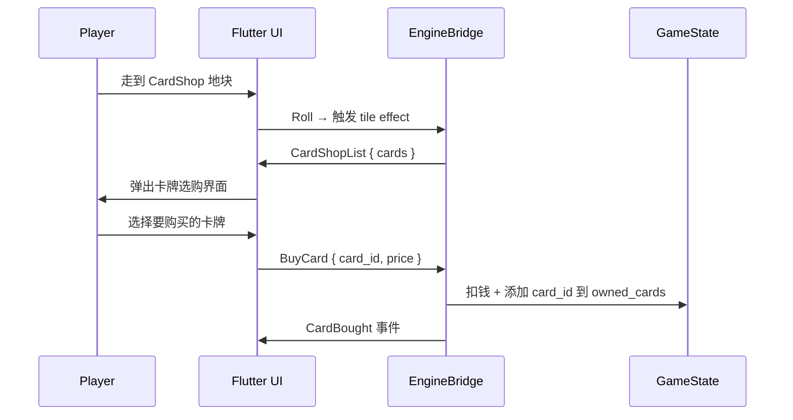
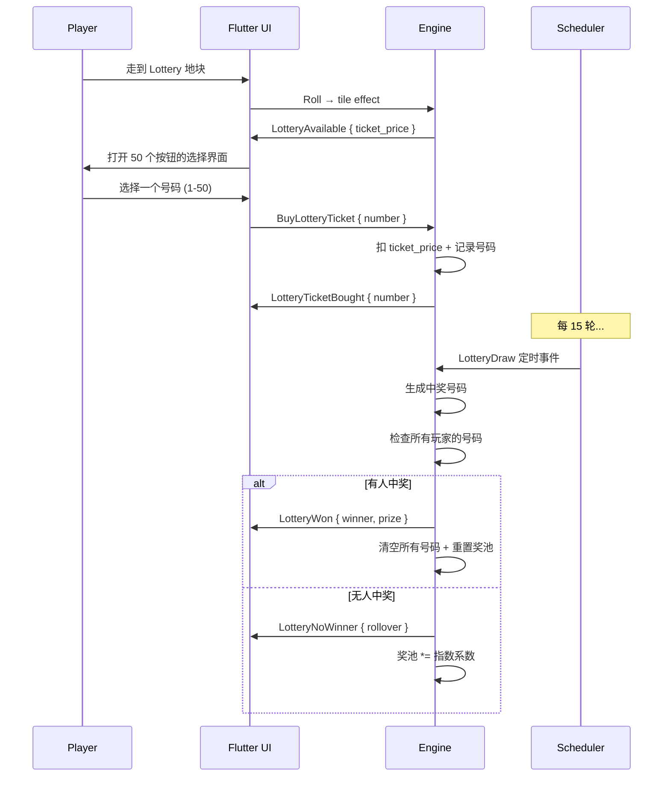

# 卡牌商店 + 彩票站 系统设计

## 1. 概述

在现有 `CardShop` 和 `Lottery` 地块基础上，实现完整的卡牌商店选购、卡片背包、以及新型彩票系统。

### 现有基础设施

| 组件 | 位置 | 状态 |
|------|------|------|
| `TileKind::CardShop` | [`tile.rs:14`](crates/domain/src/tile.rs:14) | ✅ 已定义 |
| `TileKind::Lottery` | [`tile.rs:15`](crates/domain/src/tile.rs:15) | ✅ 已定义 |
| `CardService::draw_card` | [`cards.rs:12`](crates/application/src/cards.rs:12) | ✅ Chance 抽卡用 |
| `LotteryService::buy_ticket` | [`cards.rs:44`](crates/application/src/cards.rs:44) | ⚠️ 简单版需重写 |
| `CardShop` tile effect | [`effects.rs:30-38`](crates/application/src/effects.rs:30) | ✅ 返回 CardShopList 事件 |
| `Lottery` tile effect | [`effects.rs:39-45`](crates/application/src/effects.rs:39) | ⚠️ 需改为只打开选购界面 |
| `EffectKind` / `Scheduler` | [`scheduler.rs`](crates/application/src/scheduler.rs) | ✅ 可用于 15 轮定时开奖 |
| 卡片购买命令 | `GameCommand::BuyCard` | ✅ 已存在 |
| 玩家持有卡片 | `Player.owned_cards` | ✅ 已存在 |
| Flutter CardShop 对话框 | [`main.dart:813`](flutter/lib/main.dart:813) | ⚠️ 占位；需改为选购界面 |
| Flutter Chance 卡片对话框 | [`main.dart:549`](flutter/lib/main.dart:549) | ✅ Chance 抽卡 |

---

## 2. 功能分解

### 2.1 卡牌商店（Card Shop）

**触发时机**：玩家走到 `CardShop` 地块

**流程**：



**可选购卡牌列表**（价格由前端定义，引擎只验证 `card_id` 合法性）：

| 卡牌 ID | 效果 | 价格 |
|---------|------|------|
| `get_out_of_jail` | 免狱出狱 | 50 |
| `bonus_200` | 立即获得 200 | 100 |
| `double_rent` | 下次收租翻倍 | 30 |
| `skip_turn` | 跳过一回合（对他人使用） | 20 |

### 2.2 卡片背包（Card Inventory）

**触发时机**：点击侧边栏按钮（原 "Card Shop" 更名为 "背包"）

**功能**：
- 查看当前玩家所有拥有的卡牌
- 选择并使用某张卡牌（消耗性使用）

**可使用的卡牌效果**：

| 卡牌 ID | 使用效果 | 实现方式 |
|---------|----------|----------|
| `get_out_of_jail` | 立即出狱 | 引擎已支持（自动检测）|
| `bonus_200` | +200 现金 | 引擎已支持（自动消耗）|
| `double_rent` | 下次租金翻倍 | 引擎已支持（自动消耗）|
| `skip_turn` | 跳过下回合 | 需新实现：设置 `jail_turns = 1` 但不对应入狱 |

**UI**：对话框形式，列出所有 owned_cards，每张卡牌显示名称、描述、使用按钮。

### 2.3 彩票站（Lottery）

**触发时机**：玩家走到 `Lottery` 地块

**流程**：



### 2.4 彩票数据结构

**Rust 端（domain）**：

```rust
#[derive(Debug, Clone, Serialize, Deserialize)]
pub struct LotteryState {
    /// Current jackpot pool.
    pub jackpot: i64,
    /// Fixed ticket price (base, grows with rounds).
    pub ticket_price: i64,
    /// Each player's chosen number (1-50). None if not chosen.
    pub player_numbers: HashMap<String, u32>,
    /// Turn number of the next draw.
    pub next_draw_turn: u64,
    /// Consecutive rounds with no winner (for exponential growth).
    pub consecutive_no_winner: u32,
    /// Whether a draw is currently pending resolution.
    pub draw_pending: bool,
}
```

**GameState 新增字段**：

```rust
pub struct GameState {
    // ... existing fields ...
    pub lottery_state: Option<LotteryState>,
}
```

### 2.5 奖金增长模型（独立奖金池）

**奖金池**与**玩家购票**完全脱钩。票价是玩家支付的固定入场费（归庄家），奖金池独立增长：

1. **票价**（慢速线性增长，归庄家所有）：
   ```
   BASE_TICKET_PRICE = 50
   ticket_price = BASE_TICKET_PRICE + floor(current_turn / 5) * 5
   // 玩家支付的票价不进奖池，归彩票站运营收益
   ```

2. **奖金池**（独立增长，与票价无关）：
   ```
   // 基础奖金 + 轮数自然增长
   BASE_JACKPOT = 500
   jackpot = BASE_JACKPOT + current_turn * 10         // 每轮 +10
   
   // 无人中奖时：指数级翻倍（这才是大头）
   if no_winner:
       jackpot = jackpot * (1.5 ^ consecutive_no_winner)
   ```
   例：第 30 轮时 base = 500 + 300 = 800；若连续 5 轮无人中奖，再乘 1.5^5 ≈ 7.6 倍 → 奖池 ≈ 6080。
   而票价始终只需 50 + floor(30/5)*5 = 80。**以小博大，激励玩家购彩**。

3. **开奖时**：
   - 生成随机中奖号码 (1-50)
   - 有人中奖 → 该玩家获得全部 jackpot → `consecutive_no_winner = 0` → jackpot 重置为 BASE_JACKPOT + current_turn * 10
   - 无人中奖 → `consecutive_no_winner++` → 指数增长

4. **中奖概率**：1/50（50 个号码中只有 1 个中奖号）

### 2.6 命令与事件扩展

**新增 `GameCommand` 变体**：

```rust
BuyLotteryTicket { number: u32 },
UseCard { card_id: String },
```

**新增 `GameEvent` 变体**：

```rust
/// Card Shop
CardShopList { cards: Vec<String> },
CardBought { player_id, card_id, price },
CardConsumed { player_id, card_id },

/// Lottery
LotteryAvailable { ticket_price: i64, jackpot: i64 },
LotteryTicketBought { player_id, number, ticket_price },
LotteryDraw { winning_number: u32 },
LotteryWon { player_id, prize: i64, winning_number: u32 },
LotteryNoWinner { rollover_jackpot: i64, winning_number: u32 },
```

---

## 3. 修改清单

### 3.1 Rust 后端

| 文件 | 变更 |
|------|------|
| [`crates/domain/src/state.rs`](crates/domain/src/state.rs) | 新增 `lottery_state: Option<LotteryState>` |
| [`crates/domain/src/lottery.rs`](crates/domain/src/lottery.rs) | 重写：`LotteryState` 结构体（jackpot, ticket_price, player_numbers, next_draw_turn, consecutive_no_winner, draw_pending） |
| [`crates/domain/src/lib.rs`](crates/domain/src/lib.rs) | 导出 `LotteryState` |
| [`crates/application/src/commands.rs`](crates/application/src/commands.rs) | 新增 `BuyLotteryTicket { number }`, `UseCard { card_id }` |
| [`crates/application/src/events.rs`](crates/application/src/events.rs) | 新增 `CardShopList`, `LotteryAvailable`, `LotteryTicketBought`, `LotteryDraw`, `LotteryWon`, `LotteryNoWinner` |
| [`crates/application/src/engine.rs`](crates/application/src/engine.rs) | 处理 `BuyLotteryTicket` 和 `UseCard` 命令 |
| [`crates/application/src/effects.rs`](crates/application/src/effects.rs) | `CardShop` → 返回 `CardShopList`（已有）；`Lottery` → 改为返回 `LotteryAvailable` 而非自动买票 |
| [`crates/application/src/cards.rs`](crates/application/src/cards.rs) | 重写 `LotteryService`：新增 `buy_ticket`, `draw_lottery`（定时调用）方法 |
| [`crates/application/src/ports.rs`](crates/application/src/ports.rs) | 新增 `EffectKind::LotteryDraw` |
| [`crates/application/src/scheduler.rs`](crates/application/src/scheduler.rs) | `EffectKind` 新增 `LotteryDraw` 变体 |

### 3.2 Flutter 前端

| 文件 | 变更 |
|------|------|
| [`flutter/lib/bridge_client.dart`](flutter/lib/bridge_client.dart) | 仿真模式支持 `BuyLotteryTicket` / `UseCard` 命令 |
| [`flutter/lib/main.dart`](flutter/lib/main.dart) | 3 处修改 |
| `flutter/lib/card_shop_dialog.dart` | **新增**：卡牌商店选购界面 |
| `flutter/lib/card_inventory_dialog.dart` | **新增**：卡片背包/使用界面 |
| `flutter/lib/lottery_dialog.dart` | **新增**：彩票选购+50按钮界面 |
| `flutter/lib/lottery_result_dialog.dart` | **新增**：开奖结果展示弹窗 |

### 3.3 Flutter main.dart 详细变更

| 位置 | 变更 |
|------|------|
| "Card Shop" 按钮 → "🎒 背包" | 重命名，改调 `_showCardInventoryDialog` |
| `_resolveTileEffect` `CardShop` 分支 | 调用 `_showCardShopDialog` |
| `_resolveTileEffect` `Lottery` 分支 | 调用 `_showLotteryPickerDialog` |
| 新增 `_showCardInventoryDialog()` | 显示背包内容 + 使用按钮 |
| 新增 `_onUseCard(String cardId)` | 发送 `UseCard` 命令 |
| 新增 `_onBuyLotteryTicket(int number)` | 发送 `BuyLotteryTicket` 命令 |

---

## 4. 彩票定时开奖机制

使用现有的 [`Scheduler`](crates/application/src/scheduler.rs:42) trait 和 [`VecScheduler`](crates/application/src/scheduler.rs:56)：

1. **游戏启动时**：注册 `LotteryDraw` 定时事件，`trigger_turn = 15`, `recurring = true`, `interval_turns = Some(15)`
2. **每 Tick**：`Scheduler::tick()` 检查是否有到期的 `LotteryDraw` 事件
3. **开奖时**：
   - 生成随机中奖号码 (1-50)
   - 遍历所有玩家 `lottery_state.player_numbers`
   - 如果有匹配 → 中奖者获得当前 jackpot + 清空号码 + 重置计数器
   - 无匹配 → `consecutive_no_winner++`，jackpot *= 1.5^consecutive_no_winner

---

## 5. 实现步骤

1. **Domain 层**：定义 `LotteryState`，添加到 `GameState`
2. **Application 层**：扩展 `GameCommand` + `GameEvent`，实现 `BuyLotteryTicket` 处理
3. **Application 层**：重写 `LotteryService`（`buy_ticket` + `draw_lottery`）
4. **Scheduler**：添加 `LotteryDraw` effect kind
5. **Engine**：处理新命令，集成 LotteryDraw
6. **Flutter 端**：CardShop 选购对话框
7. **Flutter 端**：卡片背包对话框
8. **Flutter 端**：彩票 50 按钮选择界面
9. **Flutter 端**：开奖结果显示
10. **构建测试**
