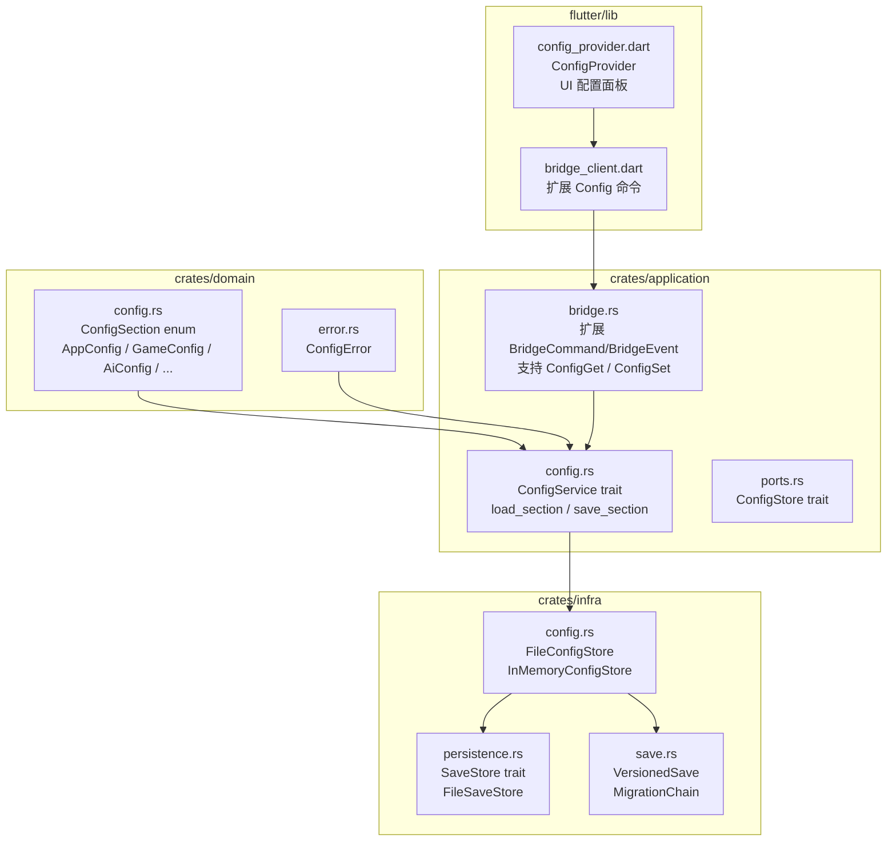
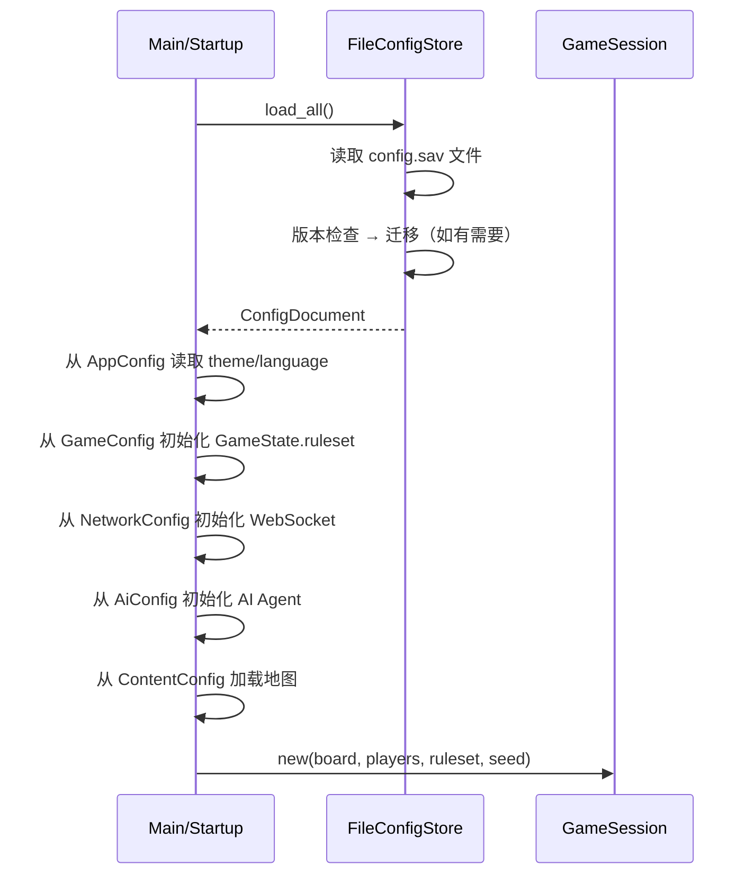
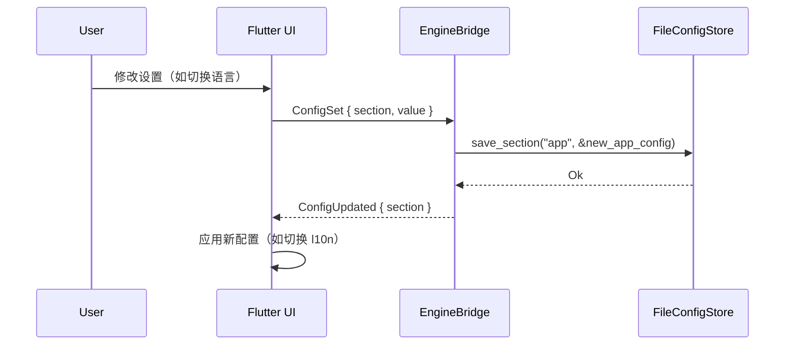

# 配置持久化系统设计

## 1. 概述

为 saMonopoly 设计一套通用的配置持久化系统，将**游戏运行过程中各类可配置的参数**以统一的方式管理、持久化和加载。

### 现有基础设施

- [`SaveStore`](crates/infra/src/persistence.rs:4) trait：Key-Value 存储抽象
- [`FileSaveStore`](crates/infra/src/persistence.rs:33)：基于文件的持久化实现
- [`SaveCodec`](crates/infra/src/save.rs:50)：序列化/反序列化抽象
- [`VersionedSave` / `MigrationChain`](crates/infra/src/save.rs:32)：版本化迁移机制
- `GameState` + 各类 `RuleSetRef` / `WebSocketConfig` / AI Agent 已散落存在

### 设计目标

1. **统一管理**：所有配置通过一套 API 读写
2. **类型安全**：编译期确保配置字段类型正确
3. **版本兼容**：配置格式变更时可迁移
4. **作用域分离**：全局配置（跨游戏会话） vs 会话配置（单局游戏）
5. **Rust + Flutter 双端**：Rust 端负责存储/迁移核心逻辑，Flutter 端负责 UI 交互展示

---

## 2. 配置分类

| 类别 | 作用域 | 示例字段 | 当前状态 |
|------|--------|----------|----------|
| **AppConfig** | 全局 | theme, language, sound_enabled, board_animation_speed | ❌ 不存在 |
| **GameConfig** | 会话 | ruleset_id, starting_cash, max_players, enable_stock_market, enable_lottery, pass_start_bonus | ⚠️ 部分存在于 GameState |
| **NetworkConfig** | 全局 | host, port, tls, max_message_size, ping_interval | ⚠️ WebSocketConfig 存在但未持久化 |
| **AIConfig** | 会话 | agent_type (heuristic/monte_carlo/llm), simulations, llm_model, llm_api_key | ⚠️ 硬编码 |
| **ContentConfig** | 全局 | enabled_maps, enabled_packs, custom_content_paths | ❌ 不存在 |
| **KeyBindings** | 全局 | keyboard_shortcuts (Flutter 端) | ❌ 不存在 |

---

## 3. 架构设计

### 3.1 核心接口层（crates/domain/src/config.rs）

新增配置域类型模块，定义所有配置结构体及其默认值。

```rust
// ── 配置分类枚举 ──
#[derive(Debug, Clone, Serialize, Deserialize)]
pub enum ConfigSection {
    App(AppConfig),
    Network(NetworkConfig),
    Ai(AiConfig),
    Content(ContentConfig),
}

// ── 应用配置 ──
#[derive(Debug, Clone, Serialize, Deserialize)]
pub struct AppConfig {
    pub language: String,           // "en" / "zh-Hans" / "ru"
    pub theme: String,              // "light" / "dark" / "system"
    pub sound_enabled: bool,
    pub animation_speed: f64,       // 0.5 ~ 2.0
    pub board_camera_zoom: f64,
}

impl Default for AppConfig { ... }

// ── 游戏规则配置 ──
#[derive(Debug, Clone, Serialize, Deserialize)]
pub struct GameConfig {
    pub ruleset_id: String,
    pub starting_cash: i64,
    pub max_players: u32,
    pub enable_stock_market: bool,
    pub enable_lottery: bool,
    pub pass_start_bonus: i64,
    pub jail_escape_turns: u32,
    pub hospital_recovery_turns: u32,
    pub auction_enabled: bool,
    pub mortgage_enabled: bool,
    pub trade_enabled: bool,
}

impl Default for GameConfig { ... }

// ── AI 配置 ──
#[derive(Debug, Clone, Serialize, Deserialize)]
pub enum AiAgentKind {
    Heuristic,
    MonteCarlo { simulations: u32 },
    Llm {
        model: String,
        api_key_placeholder: String,  // 存储占位，真实 key 在环境变量
        temperature: f64,
    },
}

#[derive(Debug, Clone, Serialize, Deserialize)]
pub struct AiConfig {
    pub agent_map: HashMap<String, AiAgentKind>, // player_id -> agent
    pub default_agent: AiAgentKind,
}

impl Default for AiConfig { ... }

// ── 内容配置 ──
#[derive(Debug, Clone, Serialize, Deserialize)]
pub struct ContentConfig {
    pub enabled_maps: Vec<String>,
    pub enabled_packs: Vec<String>,
    pub custom_content_paths: Vec<String>,
}

impl Default for ContentConfig { ... }

// ── 配置版本容器 ──
#[derive(Debug, Clone, Serialize, Deserialize)]
pub struct ConfigDocument {
    pub version: u32,
    pub sections: HashMap<String, serde_json::Value>,
}
```

### 3.2 配置存储接口（crates/application/src/config.rs）

复用已有的 [`SaveStore`](crates/infra/src/persistence.rs:4) trait，在其上包装类型安全的配置读写 API。

```rust
/// 类型安全的配置存储门面
pub trait ConfigService: Send + Sync {
    /// 加载全部配置（合并默认值 + 持久化值）
    fn load_all(&self) -> Result<ConfigDocument, ConfigError>;

    /// 保存全部配置
    fn save_all(&self, config: &ConfigDocument) -> Result<(), ConfigError>;

    /// 读取特定配置节（fallback 到 Default）
    fn load_section<T: DeserializeOwned + Default>(&self, key: &str) -> Result<T, ConfigError> {
        let doc = self.load_all()?;
        let value = doc.sections.get(key)
            .and_then(|v| serde_json::from_value(v.clone()).ok())
            .unwrap_or_default();
        Ok(value)
    }

    /// 写入特定配置节
    fn save_section<T: Serialize>(&self, key: &str, section: &T) -> Result<(), ConfigError> {
        let mut doc = self.load_all().unwrap_or(ConfigDocument::current());
        doc.sections.insert(key.to_string(), serde_json::to_value(section)?);
        self.save_all(&doc)
    }
}
```

### 3.3 存储层实现（crates/infra/src/config.rs）

基于 `FileSaveStore` 实现文件持久化：

```rust
pub struct FileConfigStore {
    store: FileSaveStore,      // 复用持久化基础
    codec: JsonVersionedSaveCodec,  // 复用版本化编码
    chain: MigrationChain,     // 复用迁移链
}

impl FileConfigStore {
    pub fn new(config_dir: PathBuf) -> Self {
        Self {
            store: FileSaveStore::new(config_dir),
            codec: JsonVersionedSaveCodec,
            chain: default_config_migration_chain(),
        }
    }
}

impl ConfigService for FileConfigStore {
    fn load_all(&self) -> Result<ConfigDocument, ConfigError> {
        match self.store.load("config") {
            Ok(bytes) => {
                let versioned: VersionedSave = self.codec.decode_versioned(&bytes)
                    .map_err(|e| ConfigError::Deserialize(e))?;
                let migrated = self.chain.migrate_to_current(
                    &versioned.data, versioned.version
                )?;
                serde_json::from_str(&migrated)
                    .map_err(|e| ConfigError::Deserialize(e.to_string()))
            }
            Err(_) => Ok(ConfigDocument::current()), // 无文件 → 默认配置
        }
    }

    fn save_all(&self, config: &ConfigDocument) -> Result<(), ConfigError> {
        let json = serde_json::to_string_pretty(config)
            .map_err(|e| ConfigError::Serialize(e.to_string()))?;
        let versioned = VersionedSave::new(CURRENT_CONFIG_VERSION, json);
        let bytes = self.codec.encode_versioned(&versioned)
            .map_err(|e| ConfigError::Serialize(e.to_string()))?;
        self.store.save("config", &bytes)
            .map_err(|e| ConfigError::Io(e))
    }
}
```

### 3.4 模块关系图



### 3.5 错误类型

```rust
#[derive(Debug, Error)]
pub enum ConfigError {
    #[error("config deserialization failed: {0}")]
    Deserialize(String),
    #[error("config serialization failed: {0}")]
    Serialize(String),
    #[error("I/O error: {0}")]
    Io(String),
    #[error("migration failed: {0}")]
    Migration(String),
}
```

---

## 4. 数据流

### 4.1 启动加载流程



### 4.2 运行时修改流程



### 4.3 Flutter 侧配置交互

现有 [`_showSettingsDialog`](flutter/lib/main.dart:824) 只处理玩家数量/名称，新的配置系统将在 Flutter 端新增一个独立配置页面：

```
Settings Screen
├── General
│   ├── Language (en/zh-Hans/ru)
│   ├── Theme (light/dark/system)
│   └── Sound ON/OFF
├── Game Rules
│   ├── Starting Cash
│   ├── Pass Start Bonus
│   ├── Jail Turns
│   ├── Stock Market ON/OFF
│   └── Lottery ON/OFF
├── AI
│   ├── Default Agent Type
│   └── Per-Player Agent Config
├── Network
│   ├── Host / Port
│   └── TLS ON/OFF
└── Content
    └── Enabled Maps / Packs
```

---

## 5. 迁移策略

复用现有的 [`VersionedSave` / `MigrationChain`](crates/infra/src/save.rs:86) 机制：

| 版本 | 变更说明 |
|------|----------|
| 1 | 初始版本，包含 AppConfig、GameConfig、NetworkConfig |
| 2 | 新增 AiConfig、ContentConfig |

```rust
pub const CURRENT_CONFIG_VERSION: u32 = 1;

pub fn default_config_migration_chain() -> MigrationChain {
    let mut chain = MigrationChain::new();
    // 注册迁移步骤：chain.add(Box::new(V1ToV2ConfigMigration));
    chain
}
```

---

## 6. 实现步骤

### Step 1：Domain 层定义配置类型

**文件**：`crates/domain/src/config.rs`

- 新增 `ConfigDocument` 结构体（含 version + sections HashMap）
- 新增 `AppConfig` / `GameConfig` / `NetworkConfig` / `AiConfig` / `ContentConfig`
- 每个结构体实现 `Default`
- 新增 `ConfigError` 错误类型（或并入现有 `DomainError`）
- 在 [`crates/domain/src/lib.rs`](crates/domain/src/lib.rs) 中导出

### Step 2：Application 层定义 ConfigService trait

**文件**：`crates/application/src/config.rs`

- 新增 `ConfigService` trait（load_all / save_all / load_section / save_section）
- 新增 `ConfigStore` port trait（可复用或扩展现有 [`SaveStore`](crates/infra/src/persistence.rs:4)）
- 导出到 [`crates/application/src/lib.rs`](crates/application/src/lib.rs)

### Step 3：Infra 层实现 FileConfigStore

**文件**：`crates/infra/src/config.rs`

- 实现 `ConfigService` for `FileConfigStore`
- 基于现有 `FileSaveStore` + `JsonVersionedSaveCodec` + `MigrationChain`
- 新增 `InMemoryConfigStore`（测试用）
- 注册到 [`crates/infra/src/lib.rs`](crates/infra/src/lib.rs)

### Step 4：扩展 Bridge 支持配置命令

**文件**：`crates/application/src/commands.rs` + `crates/application/src/bridge.rs`

- 新增 `GameCommand::ConfigGet { section }` / `GameCommand::ConfigSet { section, value }`
- 在 [`GameEngine::execute`](crates/application/src/engine.rs:15) 中处理新命令
- 新增 `GameEvent::ConfigUpdated { section }` / `GameEvent::ConfigLoaded { ... }`

### Step 5：Flutter 端配置 UI

**文件**：`flutter/lib/config_provider.dart` + 修改 `flutter/lib/main.dart`

- 新增 `ConfigProvider` 类，封装 ConfigGet/ConfigSet 命令
- 新增设置页面（替换/扩展现有 `_GameSettingsDialog`）
- 从 `AppConfig.language` 驱动 l10n 切换

### Step 6：启动集成

**文件**：`crates/application/src/startup.rs` + `crates/infra/src/startup.rs`

- 启动时创建 `FileConfigStore`，加载配置
- 将 `GameConfig` 注入 `GameSession::new()`
- 将 `AiConfig` 注入 AI Agent 工厂

---

## 7. 文件变更清单

| 文件 | 操作 | 说明 |
|------|------|------|
| `crates/domain/src/config.rs` | 新增 | 配置类型定义 |
| `crates/domain/src/error.rs` | 修改 | 新增 `ConfigError` 变体 |
| `crates/domain/src/lib.rs` | 修改 | 导出 config 模块 |
| `crates/application/src/config.rs` | 新增 | ConfigService trait |
| `crates/application/src/commands.rs` | 修改 | 新增 `ConfigGet`/`ConfigSet` 命令 |
| `crates/application/src/events.rs` | 修改 | 新增 `ConfigUpdated` 事件 |
| `crates/application/src/engine.rs` | 修改 | 处理 Config 命令 |
| `crates/application/src/lib.rs` | 修改 | 导出 config 模块 |
| `crates/infra/src/config.rs` | 新增 | FileConfigStore 实现 |
| `crates/infra/src/lib.rs` | 修改 | 导出 config 模块 |
| `crates/application/src/ports.rs` | 修改 | 新增 `ConfigStore` port |
| `flutter/lib/config_provider.dart` | 新增 | Flutter 配置管理 |
| `flutter/lib/bridge_client.dart` | 修改 | 扩展 BridgeCommand |
| `flutter/lib/main.dart` | 修改 | 集成设置页面 |

---

## 8. 边界情况与注意事项

1. **API Key 安全**：`AiConfig` 中的 `api_key` 不存储明文在配置文件中，只在配置中存占位符，真实值通过环境变量 `SA_MONOPOLY_LLM_API_KEY` 注入
2. **并发安全**：`ConfigService` 方法需要 `&self` 而非 `&mut self`，内部使用 `Mutex<...>` 或 `RwLock<...>` 保证线程安全
3. **配置不合法**：`save_section` 应做基本校验，如 `max_players` 不在 2~6 范围时返回 `ConfigError::Validation`
4. **默认值优雅降级**：配置文件的 section 缺失或解析失败 → 使用 `T::default()` 而不是报错终止
5. **文件损坏**：`load_all` 内部捕获反序列化错误，返回默认 `ConfigDocument` + 日志警告
6. **性能**：配置读写走文件 I/O，但只发生在启动时和用户手动修改时，不涉及热路径，性能不是问题
